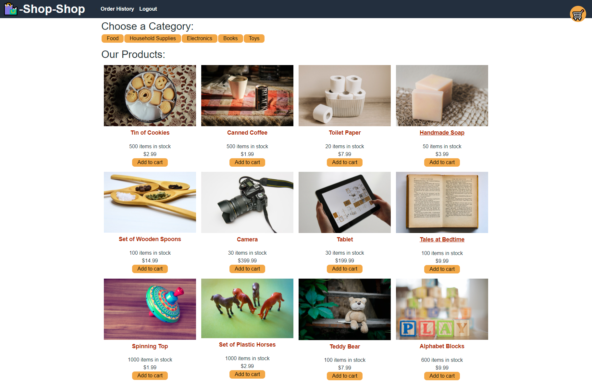

# E-commerce-shop

## Description

E-commerce-shop made with react, and refactored to use redux for state management.

   

## Table of Contents

- [Usage](#usage)

- [Credits](#credits)

- [Licenses](#license)

- [Testing](#test)

- [Questions](#questions)

## Usage

Add items to cart. Checkout and pay! (but not really pay because it's just a mock site) 
Click <a href="https://evening-springs-04317.herokuapp.com/">here</a> to start!

## Credits

Express, MongoDB, Mongoose, Apollo, GraphQL, React, Redux

## License

This application is covered under the MIT license

## Contributing

NA

## Testing

NA

## Questions

#### <a href="https://www.github.com/napo-100">GitHub</a>

#### Michaeljnapolitano@gmail.com
